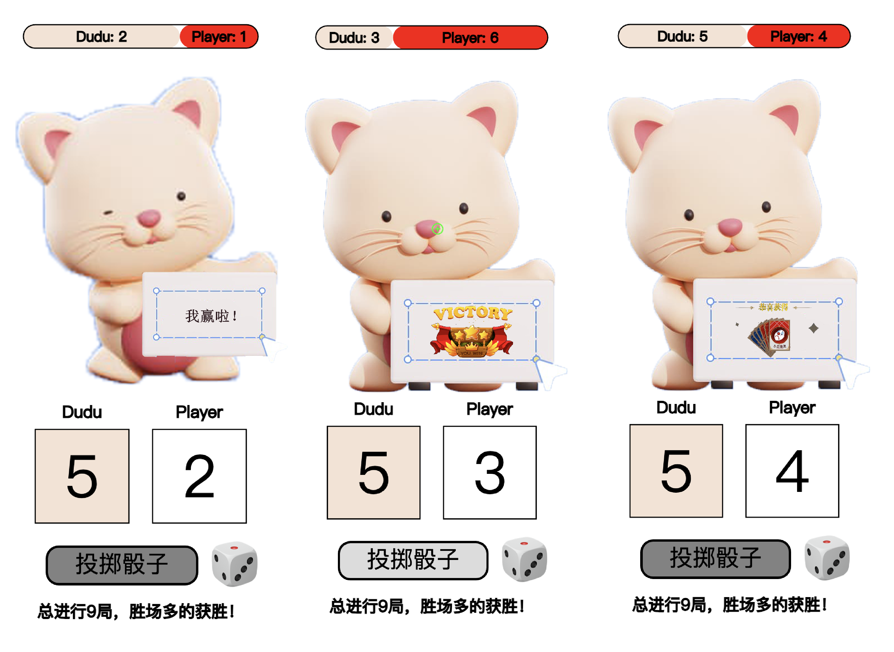

# Dudu game ——A Simple Game of Comparison
Originated from a mini-game created by our group in the 2024 Human-Computer Interaction course.

The effect is shown in the following image:



## How to use
1. Just clone our repo:

```
git clone https://github.com/Dracoqhl/p5play-game.git
```

2. Open the folder using VSCode and navigate to the sketch.js file
3. After installing the Live Server extension in VSCode, click ‘Go Live’ in the bottom right corner